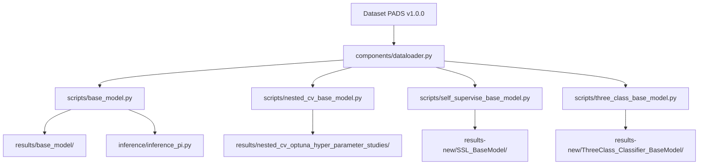

# Parkinson's Disease Detection Project - Important Overview

## Project Summary
This project implements state-of-the-art **Dual-Channel Transformer** architecture for automated Parkinson's Disease (PD) detection using smartwatch IMU sensor data. It performs hierarchical binary classification:
1. **HC vs PD**: Healthy Controls vs Parkinson's Disease patients
2. **PD vs DD**: Parkinson's Disease vs Differential Diagnosis (other disorders)

---

## Directory Structure

### Core Components (`/components/`)
- **dataloader.py** — Data loading, preprocessing, windowing utilities
- **train.py** — Training loops and validation procedures
- **model.py** — Initial model architecture definitions
- **metrics.py** — Evaluation metrics (accuracy, precision, recall, F1)
- **eda.py** — Exploratory data analysis utilities

### Training Scripts (`/scripts/`)
- **base_model.py** — Initial dual-channel transformer training (96.84% accuracy)
- **nested_cv_base_model.py** — Nested cross-validation with Optuna hyperparameter optimization
- **three_class_base_model.py** — Single three-class classifier (HC vs PD vs DD)
- **self_supervise_base_model.py** — Self-supervised learning with contrastive pre-training
- **timesfm_ablation.py** — TimesFM foundation model adaptation with LoRA
- **ablation_task_specific.py** — Per-task CNN model ablation
- **ablation_ssm_task_specific.py** — Per-task LSTM model ablation
- **patient_level_gnn.py** — Graph neural network exploration
- **eda.py** — Data exploration and visualization

### Dataset (`/pads-parkinsons-disease-smartwatch-dataset-1.0.0/`)
- PADS v1.0.0: Bilateral wrist-worn smartwatch recordings
- 10 motor tasks: CrossArms, DrinkGlas, Entrainment, HoldWeight, LiftHold, PointFinger, Relaxed, StretchHold, TouchIndex, TouchNose
- 6-axis IMU per wrist (3-axis accelerometer + 3-axis gyroscope at 100 Hz)
- Three participant groups: HC (Healthy Controls), PD (Parkinson's Disease), DD (Differential Diagnosis)

### Inference (`/inference/`)
- **inference_pi.py** — Real-time inference on Raspberry Pi (~47ms latency)
- Sample sensor data files for testing
- Pre-trained model weights

### Results & Reports
- **/results/** — Legacy experiment outputs (nested CV, task-wise ablation, initial models)
- **/results-new/** — Latest experiment results:
  - `BaseModel_wBandPass_wDownsampling/` — Preprocessed base model results
  - `SSL_BaseModel/` — Self-supervised learning results
  - `TimesFM_LoRA/` — Foundation model fine-tuning results
  - `ThreeClass_Classifier_BaseModel/` — Multi-class classification results
  - `generate_report.py` — Automated report generation
  - `main.tex` & `results_report.pdf` — LaTeX report and compiled PDF

---

## Data Preprocessing Pipeline

### Key Steps (in order):
1. **Downsampling**: 100 Hz → 64 Hz (scipy.signal.resample)
2. **Band-Pass Filter**: 4th-order Butterworth filter (0.1 Hz – 20 Hz)
3. **Windowing**: Fixed-length 256-sample windows (~4 seconds at 64 Hz)
   - HC: No overlap
   - PD/DD: Configurable overlap
4. **Patient-Level K-Fold**: Stratified 5-fold CV ensuring no data leakage

---

## Model Architectures Tested

### 1. **Dual-Channel Transformer (Base Model)** ⭐ Best Overall
```
Left Wrist → Linear Projection (6→model_dim) → Positional Encoding
Right Wrist → Linear Projection (6→model_dim) → Positional Encoding
    ↓
Cross-Attention Layers (×N) [self + cross channels]
    ↓
Global Adaptive Average Pooling
    ↓
Concatenate L+R Features (2×model_dim)
    ↓
[Optional: BERT Text Encoder + Fusion]
    ↓
Classification Heads: HC vs PD (2-class) & PD vs DD (2-class)
```
**Best Configuration:**
- model_dim: 128, num_heads: 8, num_layers: 4, d_ff: 512, dropout: 0.1
- **Result: 96.84% combined accuracy**

### 2. **Optimized Model (Optuna)** 🔧 Edge-Ready
- Smaller architecture: model_dim=32, num_layers=3
- Trade-off: 88.78% accuracy but much lower computational cost
- **Best for Raspberry Pi deployment**

### 3. **Self-Supervised Learning (SSL)**
- Contrastive pre-training + hard negative mining
- **Best Result (Hard-Finetune): 95.16% accuracy**
- Augmentation: Gaussian noise, time warping, magnitude warping, scaling, permutation

### 4. **TimesFM Foundation Model**
- Google's pre-trained time-series foundation model
- Three fine-tuning strategies:
  - **LoRA (r=8, α=16): 91.51% accuracy** ✅ Most parameter-efficient
  - Full Fine-Tune: 84.73% accuracy
  - Gradual Unfreeze: 84.24% accuracy

### 5. **Task-Wise Ablation**
- Per-task CNN & BiLSTM models
- **LSTM outperforms CNN** across all tasks
- **Most discriminative tasks**: CrossArms (75% LSTM) and HoldWeight (74% LSTM)

### 6. **Three-Class Classifier**
- Single HC vs PD vs DD classifier
- **Result: 76.17% accuracy** (significantly worse than hierarchical approach)
- ❌ Validates that dual-head architecture is superior

---

## Performance Summary

| Approach | HC vs PD | PD vs DD | Combined | Device |
|----------|----------|----------|----------|--------|
| **Base Model** | 97.10% | 96.58% | **96.84%** | GPU |
| **SSL Hard-Finetune** | 95.16% | 95.16% | **95.16%** | GPU |
| **Optuna-Optimized** | 87.87% | 89.69% | 88.78% | CPU |
| **TimesFM LoRA** | 91.51% | — | — | GPU |
| **TimesFM Full FT** | 84.73% | 77.88% | — | GPU |
| **Best Task-Wise** | ~75% | — | — | GPU |
| **Three-Class** | — | — | 76.17% | GPU |
| **Raspberry Pi Edge** | — | — | — | **47ms latency** |

---

## Key Findings & Insights

### ✅ What Works Best
1. **Dual-Channel Cross-Attention** captures bilateral motor asymmetries
2. **Hierarchical classification** (HC→PD, then PD→DD) outperforms multi-class
3. **Hard negative mining** with contrastive learning improves robustness
4. **LoRA** is the most parameter-efficient transfer learning method
5. **LSTM captures temporal dynamics** better than CNN for PD detection
6. **CrossArms & HoldWeight** are the most discriminative motor tasks

### ⚙️ Training Configuration
- **Optimizer**: AdamW
- **Scheduler**: ReduceLROnPlateau (factor=0.5, patience=5)
- **Loss**: CrossEntropyLoss (independent per task)
- **Batch Size**: 32
- **Learning Rate**: 5e-4 (base) to 2.91e-4 (optimized)
- **Epochs**: 50-100
- **Gradient Clipping**: max_norm=1.0

### 📊 Data Characteristics
- **Window Size**: 256 samples (~4 seconds)
- **Sampling Rate**: 64 Hz (after downsampling from 100 Hz)
- **Channels**: 12 (6 per wrist)
- **Participants**: Hundreds across three cohorts (HC, PD, DD)
- **Tasks**: 10 standardized motor tasks

---

## Recent Changes (Git Status)

### Modified Files
- `scripts/nested_cv_base_model.py` — In progress (A100 training improvements)
- `scripts/three_class_base_model.py` — Updated

### New Experimental Results
- `results-new/SSL_BaseModel/` — Self-supervised results
- `results-new/TimesFM_LoRA/` — LoRA fine-tuning results
- `results-new/ThreeClass_Classifier_BaseModel/` — Baseline multi-class results
- `results-new/generate_report.py` — Report automation script
- `results-new/main.tex` — LaTeX report generation

---

## Important Notes

### 🎯 Primary Objectives
- Detect PD from smartwatch IMU data with minimal computational overhead
- Enable edge inference on devices like Raspberry Pi
- Maintain high accuracy while reducing model size

### 🔑 Critical Design Decisions
1. **Dual-head architecture** instead of single multi-class classifier
2. **Cross-attention mechanism** to capture bilateral motor patterns
3. **Patient-level stratified K-Fold** to prevent data leakage
4. **Hard negative sampling** in SSL for PD/DD boundary emphasis

### 📈 Recommended Next Steps
1. Focus on **nested_cv_base_model.py** with A100 GPU optimization
2. Explore **ensemble methods** combining base model + SSL
3. Test **domain adaptation** across different smartwatch models
4. Implement **confidence thresholds** for clinical deployment

### 🚀 Deployment Status
- ✅ Base model: Ready for GPU inference
- ✅ Optimized model: Deployed on Raspberry Pi (~47ms latency)
- ⚠️ SSL models: Still in research phase
- ⚠️ Foundation models: Parameter-efficient but lower peak accuracy

---

## File Dependencies & Executions



---

## Contact & References
- **Dataset**: PADS v1.0.0 (Parkinson's Disease Smartwatch Dataset)
- **Presentation**: `Parkinson's Disease Detection Using Sensor Data and Convolutional Neural Network.pptx`
- **Paper Reference**: `2510.10558v1.pdf` (arXiv paper on related work)
