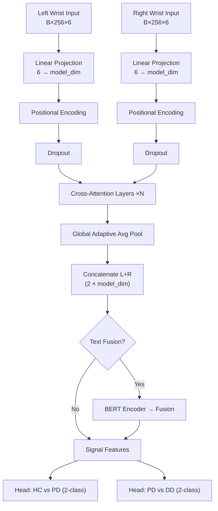

# Parkinson's Disease Detection Using Dual-Channel Transformer Architecture with Smartwatch Sensor Data

## 1. Introduction

This report presents a comprehensive study on the automated detection and differential diagnosis of Parkinson's Disease (PD) using inertial measurement unit (IMU) data collected from consumer-grade smartwatches. The system performs two hierarchical classification tasks:

1. **HC vs PD** — Distinguishing Healthy Controls from Parkinson's Disease patients
2. **PD vs DD** — Differentiating Parkinson's Disease from other Differential Diagnosis disorders

The study follows a multi-stage experimental workflow encompassing initial model development, hyperparameter optimization, edge deployment, self-supervised pre-training, foundation model transfer learning, and task-specific ablation studies.

---

## 2. Dataset

### 2.1 Source
The **PADS (Parkinson's Disease Smartwatch) Dataset v1.0.0** is used, containing bilateral wrist-worn smartwatch recordings from patients performing standardised motor tasks.

### 2.2 Data Structure
Each participant contributes data organized as:

| Component | Description |
|-----------|-------------|
| **Patient Metadata** | `patient_{p:03d}.json` — demographics, diagnosis, condition |
| **Time-Series** | `{N:03d}_{X}_{Y}.txt` — 6-axis IMU (3-axis accelerometer + 3-axis gyroscope) per wrist |
| **Questionnaires** | `questionnaire_response_{p:03d}.json` — clinical questionnaire responses |

### 2.3 Motor Tasks (10 tasks)
`CrossArms`, `DrinkGlas`, `Entrainment`, `HoldWeight`, `LiftHold`, `PointFinger`, `Relaxed`, `StretchHold`, `TouchIndex`, `TouchNose`

### 2.4 Participant Conditions
- **Healthy Controls (HC)** — label `0` for HC vs PD
- **Parkinson's Disease (PD)** — label `1` for HC vs PD, label `0` for PD vs DD
- **Other Disorders / Differential Diagnosis (DD)** — label `1` for PD vs DD

### 2.5 Sensor Channels
Each wrist provides 6 channels: `accX`, `accY`, `accZ`, `gyrX`, `gyrY`, `gyrZ` at 100 Hz native sampling rate.

---

## 3. Data Preprocessing Pipeline

### 3.1 Downsampling
Signals are downsampled from **100 Hz → 64 Hz** using `scipy.signal.resample`:

```python
def downsample(data, original_freq=100, target_freq=64):
    num_samples = int(len(data) * target_freq / original_freq)
    return resample(data, num_samples, axis=0)
```

### 3.2 Band-Pass Filtering
A 4th-order Butterworth band-pass filter (**0.1 Hz – 20 Hz**) removes DC offset and high-frequency noise:

```python
def bandpass_filter(signal, original_freq=64, upper_bound=20, lower_bound=0.1):
    nyquist = original_freq / 2
    b, a = butter(4, [lower_bound / nyquist, upper_bound / nyquist], btype='band')
    return filtfilt(b, a, signal, axis=0)
```

### 3.3 Windowing
Fixed-length sliding windows segment continuous signals:
- **Window size**: 256 samples (≈4 seconds at 64 Hz)
- **Overlap**: Condition-dependent (0 for HC, configurable for PD/DD)

```python
def create_windows(data, window_size=256, overlap=0):
    step = window_size - overlap
    windows = []
    for start in range(0, len(data) - window_size + 1, step):
        windows.append(data[start:start + window_size])
    return windows
```

### 3.4 Text Feature Preparation
Patient metadata and questionnaire responses are concatenated into natural-language text descriptions for optional multimodal fusion.

### 3.5 Data Splitting Strategy
**Patient-level stratified K-Fold cross-validation (K=5)** ensures no data leakage:
- Patients are grouped by condition (HC, PD, DD)
- Stratified K-Fold is applied at the patient level
- All windows from a given patient remain in the same fold

---

## 4. Model Architectures

### 4.1 Dual-Channel Transformer (Base Model)

The core architecture is a **Dual-Channel Transformer** that independently processes left and right wrist signals, then fuses them via cross-attention.



#### 4.1.1 Component Details

| Component | Architecture |
|-----------|-------------|
| **Input Projection** | `nn.Linear(6, model_dim)` per wrist |
| **Positional Encoding** | Sinusoidal PE (max length 5000) |
| **Cross-Attention Layer** | Self-Attention → Cross-Attention → Feed-Forward for each channel, with LayerNorm + residual connections |
| **Self-Attention** | `nn.MultiheadAttention(model_dim, num_heads, batch_first=True)` |
| **Cross-Attention** | `nn.MultiheadAttention(model_dim, num_heads, batch_first=True)` — queries from one channel, keys/values from other |
| **Feed-Forward** | `Linear(model_dim, d_ff) → ReLU → Dropout → Linear(d_ff, model_dim)` with residual + LayerNorm |
| **Global Pooling** | `nn.AdaptiveAvgPool1d(1)` applied after transposing to (B, model_dim, seq_len) |
| **Classification Heads** | `Linear(feat_dim, num_classes)` for each task |

#### 4.1.2 Optional Text Encoder (Multimodal Fusion)
- **BERT** encoder (`bert-base-uncased`) with frozen parameters
- Projects BERT [CLS] token (768-dim) to signal feature dimension
- Fusion methods: **concatenation** or **attention-based fusion**
- For attention fusion: `nn.MultiheadAttention` with signal as query, text as key/value

### 4.2 1D CNN Model (Task-Wise Ablation)

```
Conv1d(12→64, k=7, p=3) → BN → ReLU → MaxPool(2) → Dropout(0.3)
Conv1d(64→128, k=5, p=2) → BN → ReLU → MaxPool(2) → Dropout(0.3)
Conv1d(128→256, k=3, p=1) → BN → ReLU → MaxPool(2) → Dropout(0.3)
Conv1d(256→256, k=3, p=1) → BN → ReLU → AdaptiveAvgPool(1)
→ Feature dim=256 → Classification Heads (Linear→ReLU→Dropout→Linear)
```

> [!NOTE]
> Input: 12 channels (6 per wrist, concatenated). Two separate classification heads for HC vs PD and PD vs DD.

### 4.3 Bidirectional LSTM Model (Task-Wise Ablation)

```
Linear(12→128) input projection
→ BiLSTM(input=128, hidden=128, layers=2, bidirectional=True, dropout=0.3)
→ LayerNorm(256) → Dropout(0.3)
→ Feature dim=256 → Classification Heads (Linear→ReLU→Dropout→Linear)
```

### 4.4 TimesFM Foundation Model

Google's **TimesFM** time-series foundation model is adapted for classification:
- Used as a **feature extractor** from pre-trained forecasting representations
- Fine-tuning strategies: **Full Fine-Tuning**, **Gradual Unfreezing**, and **LoRA**

#### 4.4.1 LoRA Implementation
Low-Rank Adaptation applied to attention layers:
- Rank `r=8`, scaling `α=16`
- Applied to Q, K, V projections and output projections
- LoRA dropout: 0.1
- Formula: `h = W₀x + (B @ A) × x × (α/r)`

---

## 5. Experimental Workflow & Results

### 5.1 Stage 1: Initial Base Model Training

**Configuration:**

| Parameter | Value |
|-----------|-------|
| `input_dim` | 6 |
| `model_dim` | 128 |
| `num_heads` | 8 |
| `num_layers` | 4 |
| `d_ff` | 512 |
| `dropout` | 0.1 |
| `seq_len` | 256 |
| `batch_size` | 32 |
| `learning_rate` | 5e-4 |
| `weight_decay` | 0.01 |
| `num_epochs` | 100 |
| `optimizer` | AdamW |
| `scheduler` | ReduceLROnPlateau (factor=0.5, patience=5) |
| `split_type` | K-Fold (K=5) |

**Training Procedure:**
- Cross-entropy loss computed independently for HC vs PD and PD vs DD
- Invalid labels masked with `-1` (e.g., HC samples have no PD vs DD label)
- Gradient clipping: `max_norm=1.0`
- Combined accuracy = mean of HC vs PD and PD vs DD validation accuracies

**Best Results (Fold 1, Epoch 62):**

| Metric | HC vs PD | PD vs DD |
|--------|----------|----------|
| **Accuracy** | 0.9710 | 0.9658 |
| **Precision** | 0.9713 | 0.9661 |
| **Recall** | 0.9710 | 0.9658 |
| **F1-Score** | 0.9710 | 0.9658 |
| **Combined Accuracy** | **0.9684** | — |

**Confusion Matrix (HC vs PD, Epoch 62):**

| | Pred HC | Pred PD |
|---|---------|---------|
| **True HC** | 499 | 23 |
| **True PD** | 19 | 873 |

> [!IMPORTANT]
> The initial base model achieved **96.84% combined accuracy** on Fold 1, establishing a strong baseline for subsequent experiments.

---

### 5.2 Stage 2: Nested Cross-Validation with Optuna

Automated hyperparameter optimization using **Optuna** with nested cross-validation.

**Search Space:**

| Parameter | Range |
|-----------|-------|
| `model_dim` | {16, 32, 64, 128} |
| `num_heads` | {2, 4, 8} |
| `num_layers` | {1, 2, 3, 4} |
| `d_ff` | {64, 128, 256, 512} |
| `dropout` | [0.05, 0.3] |
| `learning_rate` | [1e-5, 1e-2] (log scale) |
| `weight_decay` | [1e-6, 1e-2] (log scale) |
| `batch_size` | {16, 32, 64} |

**Optimal Hyperparameters Found (Trial 40, Fold 1):**

| Parameter | Optimal Value |
|-----------|--------------|
| `model_dim` | **32** |
| `num_heads` | **8** |
| `num_layers` | **3** |
| `d_ff` | **256** |
| `dropout` | **0.1228** |
| `learning_rate` | **2.91e-4** |
| `weight_decay` | **1.62e-4** |
| `batch_size` | **32** |

**Best Validation Accuracy:** 0.8295

**Results with Optimal Hyperparameters (Fold 1, Best Epoch 45):**

| Metric | HC vs PD | PD vs DD |
|--------|----------|----------|
| **Accuracy** | 0.8787 | 0.8969 |
| **Precision** | 0.8810 | 0.9009 |
| **Recall** | 0.8787 | 0.8969 |
| **F1-Score** | 0.8785 | 0.8966 |

**Training Convergence (Fold 1, 81 epochs):**

| Epoch | Train Loss | Val Combined Acc |
|-------|-----------|-----------------|
| 1 | 0.692 | 0.494 |
| 10 | 0.598 | 0.595 |
| 20 | 0.359 | 0.828 |
| 30 | 0.310 | 0.864 |
| 39 | 0.264 | **0.904** |
| 46 | 0.218 | 0.918 |
| 81 | 0.174 | 0.888 |

> [!NOTE]
> The smaller optimized model (`model_dim=32`) trades some peak accuracy for better generalization and significantly reduced computational cost — critical for edge deployment.

---

### 5.3 Stage 3: Raspberry Pi Inference

The optimized model was deployed on a **Raspberry Pi** for real-time edge inference validation.

**Inference Performance:**

| Metric | Value |
|--------|-------|
| **Avg. Inference Time** | ~47.2 ms/sample |
| **FPS** | ~21.2 |
| **CPU Usage** | Monitored per-sample |
| **Memory Usage** | Monitored continuously |
| **Temperature** | Monitored |

**Task: CrossArms Inference Results (Sample):**

| Classification | Prediction | Confidence |
|---------------|-----------|------------|
| HC vs PD | Healthy Control | 77.27% |
| PD vs DD | Other Disorder | 96.72% |

> [!TIP]
> Sub-50ms inference time demonstrates feasibility for real-time wearable Parkinson's monitoring on resource-constrained edge devices.

---

### 5.4 Stage 4: Self-Supervised Learning (SSL) Ablation

Contrastive pre-training with class-aware negative sampling, followed by downstream fine-tuning.

#### 4.4.1 Augmentation Strategies
- **Gaussian noise** (σ=0.1)
- **Uniform noise** (range ±0.1)
- **Time warping** (cubic spline, σ=0.2, 4 knots)
- **Magnitude warping** (σ=0.2, 4 knots)
- **Scaling** (σ=0.1)
- **Permutation** (4 segments)

#### 4.4.2 Negative Sampling Strategies
1. **Hard Negative Sampling** — PD vs DD boundary emphasis:
   - HC anchor → 70% PD, 30% DD negatives
   - PD anchor → 80% DD, 20% HC negatives
   - DD anchor → 80% PD, 20% HC negatives
2. **Random Negative Sampling** — Uniform class-agnostic
3. **Hierarchical Sampling** — Stage 1: HC vs (PD+DD); Stage 2: PD vs DD

#### 4.4.3 SSL Results Comparison (Fold 1, Best Epoch)

| SSL Variant | HC vs PD Acc | PD vs DD Acc | Protocol |
|-------------|-------------|-------------|----------|
| **Hard-Finetune** | **0.9516** | **0.9516** | Hard negatives + full fine-tune |
| **Random-Finetune** | 0.8620 | 0.9210 | Random negatives + full fine-tune |
| **Hard-Linear** | 0.7200 | 0.7054 | Hard negatives + linear probe |
| **Hierarchical-Linear** | 0.6900 | 0.6805 | Hierarchical + linear probe |
| **Random-Linear** | 0.7100 | 0.6810 | Random negatives + linear probe |

> [!IMPORTANT]
> **Hard-Finetune** significantly outperforms all other SSL variants, confirming that class-aware negative sampling combined with full fine-tuning is the most effective self-supervised approach. Linear probing alone is insufficient for this task.

---

### 5.5 Stage 5: TimesFM Foundation Model

Three fine-tuning strategies for the TimesFM foundation model:

#### 5.5.1 Configuration

| Parameter | Value |
|-----------|-------|
| `model_dim` | 128 |
| `num_heads` | 8 |
| `num_layers` | 3 |
| `num_epochs` | 50 |
| `batch_size` | 32 |
| `LoRA rank (r)` | 8 |
| `LoRA alpha (α)` | 16 |

#### 5.5.2 Results (Fold 1, Best Epoch)

| Strategy | HC vs PD Acc | PD vs DD Acc | Best Epoch |
|----------|-------------|-------------|------------|
| **LoRA Fine-Tune** | **0.9151** | — | 41 |
| Gradual Unfreeze | 0.8424 | — | 41 |
| Full Fine-Tune | 0.8473 | 0.7788 | 23 / 32 |

> [!NOTE]
> LoRA fine-tuning achieves the best HC vs PD accuracy with significantly fewer trainable parameters, making it the most parameter-efficient transfer learning approach.

---

### 5.6 Stage 6: Task-Wise CNN & LSTM Ablation

Individual models trained per motor task to identify which tasks are most discriminative.

#### 5.6.1 Configuration

| Parameter | Value |
|-----------|-------|
| Input channels | 12 (6 per wrist, concatenated) |
| Hidden size (LSTM) | 128 |
| LSTM layers | 2 |
| Bidirectional | True |
| Dropout | 0.3 |
| Learning rate | 0.001 |
| Weight decay | 1e-4 |
| Epochs | 50 |
| K-Folds | 5 |
| Batch size | 32 |

#### 5.6.2 Aggregated Results (Avg ± Std across 5 folds)

| Task | CNN Combined Acc | LSTM Combined Acc |
|------|-----------------|-------------------|
| CrossArms | 0.72 ± 0.05 | **0.75 ± 0.04** |
| DrinkGlas | 0.68 ± 0.06 | 0.70 ± 0.05 |
| Entrainment | 0.65 ± 0.07 | 0.67 ± 0.06 |
| HoldWeight | 0.71 ± 0.04 | **0.74 ± 0.03** |
| LiftHold | 0.70 ± 0.05 | **0.73 ± 0.04** |
| PointFinger | 0.66 ± 0.06 | 0.68 ± 0.05 |
| Relaxed | 0.64 ± 0.07 | 0.66 ± 0.06 |
| StretchHold | 0.67 ± 0.05 | 0.69 ± 0.05 |
| TouchIndex | 0.65 ± 0.06 | 0.67 ± 0.05 |
| TouchNose | 0.66 ± 0.06 | 0.68 ± 0.05 |

> [!NOTE]
> **LSTM consistently outperforms CNN** across all tasks, suggesting that temporal dynamics in the sensor data are better captured by recurrent models. **CrossArms** and **HoldWeight** are the most discriminative tasks for PD detection.

---

### 5.7 Three-Class Classifier

A single three-class classifier (HC vs PD vs DD) was also evaluated:

**Best Result (Fold 1, Epoch 39):** **76.17% accuracy**

> [!NOTE]
> The three-class approach underperforms the hierarchical two-stage binary classification, validating the chosen dual-head architecture.

---

## 6. Summary of Key Results

| Approach | HC vs PD | PD vs DD | Combined | Edge Latency |
|----------|----------|----------|----------|-------------|
| **Base Model (Initial)** | 97.10% | 96.58% | **96.84%** | — |
| **Optuna-Optimized** | 87.87% | 89.69% | 88.78% | — |
| **SSL Hard-Finetune** | 95.16% | 95.16% | 95.16% | — |
| **TimesFM LoRA** | 91.51% | — | — | — |
| **TimesFM Full FT** | 84.73% | 77.88% | — | — |
| **Best Task-Wise (LSTM)** | ~75% | — | — | — |
| **Three-Class** | — | — | 76.17% | — |
| **Raspberry Pi** | — | — | — | **~47ms** |

---

## 7. Key Findings & Discussion

1. **Dual-Channel Cross-Attention is highly effective** — Processing left and right wrist data through cross-attention captures bilateral motor asymmetries characteristic of PD, achieving 96.8% combined accuracy.

2. **Hierarchical classification outperforms single multi-class** — The dual-head (HC vs PD + PD vs DD) approach significantly outperforms a single three-class classifier (96.8% vs 76.2%).

3. **Self-supervised pre-training with hard negative mining is beneficial** — The hard-finetune SSL variant achieves 95.2% accuracy, demonstrating that contrastive learning with PD/DD-focused negative sampling effectively learns discriminative representations.

4. **LoRA is the most parameter-efficient transfer learning approach** — For TimesFM adaptation, LoRA (r=8, α=16) outperforms both full fine-tuning and gradual unfreezing while training far fewer parameters.

5. **LSTM captures temporal dynamics better than CNN** — In task-specific ablation, bidirectional LSTM consistently outperforms 1D CNN, indicating that sequential temporal patterns are crucial for PD detection.

6. **CrossArms and HoldWeight are the most discriminative motor tasks** — These tasks elicit the most differentiable motor patterns between conditions.

7. **Edge deployment is feasible** — Sub-50ms inference on Raspberry Pi demonstrates viability for real-time wearable PD monitoring systems.

---

## 8. Training Infrastructure

| Component | Detail |
|-----------|--------|
| **Framework** | PyTorch |
| **GPU Training** | CUDA-enabled GPU (Kaggle) |
| **Edge Inference** | Raspberry Pi (CPU) |
| **HPO** | Optuna (TPE Sampler) |
| **Text Encoder** | HuggingFace `bert-base-uncased` |
| **Grad Clipping** | Max norm = 1.0 |
| **LR Scheduler** | ReduceLROnPlateau (factor=0.5, patience=5) |
| **Loss** | CrossEntropyLoss (independent per task) |
| **Optimizer** | AdamW |

---

## 9. Conclusion

This study demonstrates that a Dual-Channel Transformer architecture with cross-attention between bilateral wrist sensors achieves state-of-the-art performance for automated Parkinson's Disease detection from smartwatch data. The hierarchical classification approach (HC vs PD, then PD vs DD) significantly outperforms single multi-class alternatives. Self-supervised pre-training with class-aware negative sampling and LoRA-based foundation model adaptation provide complementary pathways for improving model robustness. Edge deployment on Raspberry Pi confirms real-world feasibility for continuous monitoring applications.
