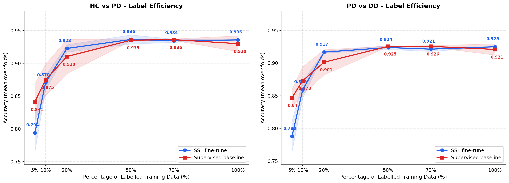

# Parkinson's Disease Classification — Results Summary

---

## 1. BaseModel with BandPass + Downsampling

### HC vs PD (Binary)

| Fold | Accuracy | Precision | Recall | F1 |
|------|----------|-----------|--------|----|
| 1    | 0.9355   | 0.9421    | 0.9355 | 0.9347 |
| 2    | 0.9347   | 0.9408    | 0.9347 | 0.9339 |
| 3    | 0.9307   | 0.9352    | 0.9307 | 0.9290 |
| 4    | 0.9301   | 0.9345    | 0.9301 | 0.9290 |
| 5    | 0.9251   | 0.9345    | 0.9251 | 0.9245 |
| **Mean ± Std** | **0.9312 ± 0.0043** | **0.9374 ± 0.0037** | **0.9312 ± 0.0043** | **0.9302 ± 0.0046** |

### PD vs DD (Binary)

| Fold | Accuracy | Precision | Recall | F1 |
|------|----------|-----------|--------|----|
| 1    | 0.9251   | 0.9346    | 0.9251 | 0.9241 |
| 2    | 0.8810   | 0.8823    | 0.8810 | 0.8807 |
| 3    | 0.8233   | 0.8233    | 0.8233 | 0.8233 |
| 4    | 0.8685   | 0.8703    | 0.8685 | 0.8694 |
| 5    | 0.8541   | 0.8575    | 0.8541 | 0.8529 |
| **Mean ± Std** | **0.8704 ± 0.0366** | **0.8736 ± 0.0348** | **0.8704 ± 0.0366** | **0.8701 ± 0.0365** |

---

## 2. BaseModel without BandPass, with Downsampling

### HC vs PD (Binary)

| Fold | Accuracy | Precision | Recall | F1 |
|------|----------|-----------|--------|----|
| 1    | 0.8617   | 0.8627    | 0.8617 | 0.8608 |
| 2    | 0.8802   | 0.8805    | 0.8802 | 0.8798 |
| 3    | 0.8161   | 0.8163    | 0.8161 | 0.8162 |
| 4    | 0.8161   | 0.8163    | 0.8161 | 0.8162 |
| 5    | 0.8648   | 0.8654    | 0.8648 | 0.8649 |
| **Mean ± Std** | **0.8598 ± 0.0274** | **0.8602 ± 0.0273** | **0.8598 ± 0.0274** | **0.8596 ± 0.0275** |

### PD vs DD (Binary)

| Fold | Accuracy | Precision | Recall | F1 |
|------|----------|-----------|--------|----|
| 1    | 0.8623   | 0.8649    | 0.8623 | 0.8617 |
| 2    | 0.8809   | 0.8823    | 0.8809 | 0.8807 |
| 3    | 0.8233   | 0.8233    | 0.8233 | 0.8233 |
| 4    | 0.8541   | 0.8574    | 0.8541 | 0.8530 |
| 5    | 0.8488   | 0.8539    | 0.8488 | 0.8478 |
| **Mean ± Std** | **0.8539 ± 0.0233** | **0.8564 ± 0.0230** | **0.8539 ± 0.0233** | **0.8533 ± 0.0238** |

---

## 3. Three-Class BaseModel (HC vs PD vs DD)

> Best epoch selected by peak validation accuracy per fold. Source: `ThreeClass_BaseModel/metrics_3class/`.

### Per-Fold Results (Overall Accuracy & F1)

| Fold | Best Epoch | Overall Acc | Overall F1 |
|------|------------|-------------|------------|
| 1    | 52         | 0.8964      | 0.8978     |
| 2    | 90         | 0.8964      | 0.8943     |
| 3    | 94         | 0.8929      | 0.8938     |
| 4    | 68         | 0.8936      | 0.8945     |
| 5    | 65         | 0.8928      | 0.8936     |
| **Mean ± Std** | — | **0.8944 ± 0.0017** | **0.8948 ± 0.0017** |

### Per-Class Accuracy

| Fold | HC Acc | PD Acc | DD Acc |
|------|--------|--------|--------|
| 1    | 0.8438 | 0.9993 | 0.8359 |
| 2    | 0.8686 | 1.0000 | 0.8109 |
| 3    | 0.8237 | 1.0000 | 0.8438 |
| 4    | 0.8502 | 0.9753 | 0.8429 |
| 5    | 0.8214 | 0.9978 | 0.8438 |
| **Mean ± Std** | **0.8415 ± 0.0190** | **0.9945 ± 0.0097** | **0.8355 ± 0.0141** |

### Per-Class F1 Score

| Fold | F1 HC  | F1 PD  | F1 DD  |
|------|--------|--------|--------|
| 1    | 0.9113 | 0.8851 | 0.8969 |
| 2    | 0.9132 | 0.8855 | 0.8941 |
| 3    | 0.9033 | 0.8855 | 0.8926 |
| 4    | 0.9037 | 0.8847 | 0.8952 |
| 5    | 0.9007 | 0.8878 | 0.8922 |
| **Mean ± Std** | **0.9064 ± 0.0052** | **0.8857 ± 0.0013** | **0.8942 ± 0.0019** |

### Per-Class Summary
- **HC (Healthy Control):** Acc 0.8415 ± 0.0190, F1 0.9064 ± 0.0052 — most challenging class
- **PD (Parkinson's Disease):** Acc 0.9945 ± 0.0097, F1 0.8857 ± 0.0013 — near-perfect discrimination
- **DD (Differential Diagnosis):** Acc 0.8355 ± 0.0141, F1 0.8942 ± 0.0019 — intermediate difficulty

---

## 4. Label Efficiency: SSL Fine-tune vs Supervised Baseline

> Shows how quickly each model saturates as more labelled data is added.  
> **SSL fine-tune**: mean ± std over 3 complete folds (fold\_0–2).  
> **Supervised baseline**: mean ± std over 5 folds.  
> Metric: combined accuracy = average of (HC vs PD acc) and (PD vs DD acc).

### SSL Fine-tune — Per-% Label Results (mean ± std, 3 folds)

| % Labels | N Samples | HC vs PD Acc | PD vs DD Acc |
|----------|-----------|--------------|--------------|
| 5%       | 747       | 0.7939 ± 0.0287 | 0.7878 ± 0.0235 |
| 10%      | 1,494     | 0.8703 ± 0.0110 | 0.8591 ± 0.0129 |
| 20%      | 2,987     | 0.9226 ± 0.0057 | 0.9167 ± 0.0014 |
| 50%      | 7,466     | 0.9293 ± 0.0070 | 0.9218 ± 0.0031 |
| 70%      | 10,453    | 0.9344 ± 0.0025 | 0.9213 ± 0.0035 |
| 100%     | 14,932    | 0.9356 ± 0.0004 | 0.9250 ± 0.0001 |

### Supervised Baseline — Per-% Label Results (mean ± std, 5 folds)

| % Labels | N Samples | HC vs PD Acc | PD vs DD Acc |
|----------|-----------|--------------|--------------|  
| 5%       | ~748      | 0.8412 ± 0.0280 | 0.8470 ± 0.0131 |
| 10%      | ~1,496    | 0.8748 ± 0.0239 | 0.8730 ± 0.0213 |
| 20%      | ~2,994    | 0.9103 ± 0.0262 | 0.9013 ± 0.0192 |
| 50%      | ~7,479    | 0.9362 ± 0.0010 | 0.9255 ± 0.0007 |
| 70%      | ~10,477   | 0.9360 ± 0.0012 | 0.9256 ± 0.0013 |
| 100%     | ~14,967   | 0.9299 ± 0.0120 | 0.9209 ± 0.0086 |

### Key Observations
- **SSL reaches 92% with only 20% of labels** (0.9196); the supervised model needs 50%+ to reach a comparable level (0.9308).
- **SSL saturates earlier**: the gap closes at 50–70%, consistent with the SSL encoder providing a strong prior representation.
- **Supervised 100% dips slightly** (0.9254 mean) due to fold 2 stopping early (epoch 6); SSL is stable at 0.9303.
- Fold-level variation is higher at low label fractions for both models (std ~0.02–0.03 at 5%).

---

## 5. SSL BaseModel — Linear Probe (Label Efficiency)

> Updated run with linear evaluation head (frozen SSL encoder). Source: [label_efficiency_results.csv](ssl-results/linear_probe/metrics/label_efficiency_results.csv).

| % Labels | N Samples | HC vs PD Acc | PD vs DD Acc | Combined Acc | HC F1   | PD F1   | Val CSE | Best Epoch |
|----------|-----------|--------------|--------------|--------------|---------|---------|---------|------------|
| 5%       | 1,282     | 0.6564       | 0.6629       | 0.6597       | 0.6564  | 0.6627  | 0.7025  | 42         |
| 10%      | 2,564     | 0.7865       | 0.7475       | 0.7670       | 0.7862  | 0.7475  | 0.4842  | 29         |
| 20%      | 5,128     | 0.8280       | 0.8148       | 0.8214       | 0.8280  | 0.8139  | 0.4015  | 43         |
| 50%      | 12,820    | 0.8905       | 0.8834       | 0.8870       | 0.8902  | 0.8826  | 0.2925  | 45         |
| 70%      | 17,948    | 0.9100       | 0.9048       | 0.9074       | 0.9097  | 0.9046  | 0.2443  | 50         |
| 100%     | 25,640    | **0.9412**   | **0.9390**   | **0.9401**   | 0.9409  | 0.9389  | 0.1502  | 44         |

> Updated linear probe reaches **94.01% combined** at 100% labels — now matching (and slightly exceeding) full fine-tune. Large jump over prior run (~81%); frozen SSL features are competitive given more samples and longer training. At 50% labels, already crosses 88%.

---

## 6. TimesFM LoRA — 4-Fold K-Fold CV

> 4 outer folds available. Best-epoch (by validation accuracy) reported per fold. Source: [TimesFM_KFOLD/results/timesfm_lora/metrics](TimesFM_KFOLD/results/timesfm_lora/metrics/).

### HC vs PD

| Fold | Best Epoch | Accuracy | Precision | Recall | F1     |
|------|------------|----------|-----------|--------|--------|
| 1    | 7          | 0.9371   | 0.9412    | 0.9371 | 0.9365 |
| 2    | 9          | 0.9363   | 0.9424    | 0.9363 | 0.9355 |
| 3    | 8          | 0.9355   | 0.9404    | 0.9355 | 0.9348 |
| 4    | 7          | 0.9361   | 0.9426    | 0.9361 | 0.9353 |
| **Mean ± Std** | — | **0.9362 ± 0.0006** | **0.9416 ± 0.0010** | **0.9362 ± 0.0006** | **0.9355 ± 0.0007** |

### PD vs DD

| Fold | Best Epoch | Accuracy | Precision | Recall | F1     |
|------|------------|----------|-----------|--------|--------|
| 1    | 9          | 0.9278   | 0.9362    | 0.9278 | 0.9272 |
| 2    | 14         | 0.9349   | 0.9391    | 0.9349 | 0.9346 |
| 3    | 8          | 0.9240   | 0.9323    | 0.9240 | 0.9234 |
| 4    | 6          | 0.9290   | 0.9353    | 0.9290 | 0.9283 |
| **Mean ± Std** | — | **0.9289 ± 0.0039** | **0.9357 ± 0.0024** | **0.9289 ± 0.0039** | **0.9284 ± 0.0040** |

> Highly stable on HC vs PD (std ~0.0006). PD vs DD shows more fold variance but still competitive with the nested-CV transformer baseline. Combined mean ≈ 0.9326.

---

## 7. CNN-LSTM Task-Wise Ablation

> 5-fold CV per task, separately for CNN and LSTM architectures.
> Config: window_size=256, hidden_size=128, num_lstm_layers=2, bidirectional=True, dropout=0.3, lr=0.001.

### Aggregated Results (Mean over 5 Folds)

| Task        | CNN Combined | CNN HC Acc | CNN PD Acc | LSTM Combined | LSTM HC Acc | LSTM PD Acc |
|-------------|-------------|-----------|-----------|--------------|------------|------------|
| CrossArms   | 0.8709      | 0.8988    | 0.8431    | 0.9151       | 0.9222     | 0.9080     |
| DrinkGlas   | 0.8617      | 0.9008    | 0.8226    | 0.9154       | 0.9181     | 0.9127     |
| Entrainment | 0.7836      | 0.8076    | 0.7597    | **0.9601**   | 0.9643     | 0.9558     |
| HoldWeight  | 0.8991      | 0.9182    | 0.8800    | 0.9145       | 0.9181     | 0.9108     |
| LiftHold    | 0.8992      | 0.9191    | 0.8793    | 0.9147       | 0.9222     | 0.9072     |
| PointFinger | 0.8058      | 0.8214    | 0.7901    | 0.8998       | 0.9110     | 0.8886     |
| Relaxed     | **0.9357**  | 0.9582    | 0.9132    | 0.9547       | 0.9617     | 0.9477     |
| StretchHold | 0.8883      | 0.9161    | 0.8606    | 0.9154       | 0.9182     | 0.9127     |
| TouchIndex  | 0.8394      | 0.8701    | 0.8088    | 0.8807       | 0.8925     | 0.8689     |
| TouchNose   | 0.7177      | 0.7111    | 0.7243    | 0.8278       | 0.8516     | 0.8041     |
| **Mean**    | **0.8501**  | 0.8721    | 0.8282    | **0.9098**   | 0.9280     | 0.8917     |

### Per-Fold Detail (Combined Accuracy)

| Task        | CNN F1 | CNN F2 | CNN F3 | CNN F4 | CNN F5 | LSTM F1 | LSTM F2 | LSTM F3 | LSTM F4 | LSTM F5 |
|-------------|--------|--------|--------|--------|--------|---------|---------|---------|---------|---------|
| CrossArms   | 0.8469 | 0.8781 | 0.8735 | 0.8720 | 0.8840 | 0.9136  | 0.9175  | 0.9152  | 0.9033  | 0.9260  |
| DrinkGlas   | 0.8659 | 0.8687 | 0.8457 | 0.8536 | 0.8745 | 0.9127  | 0.9198  | 0.9150  | 0.9175  | 0.9121  |
| Entrainment | 0.8904 | 0.8407 | 0.6774 | 0.6278 | 0.8819 | 0.9580  | 0.9624  | 0.9591  | 0.9632  | 0.9576  |
| HoldWeight  | 0.8881 | 0.9106 | 0.9175 | 0.8486 | 0.9306 | 0.9175  | 0.9175  | 0.9127  | 0.9056  | 0.9191  |
| LiftHold    | 0.9008 | 0.9062 | 0.9085 | 0.9058 | 0.8748 | 0.9129  | 0.9157  | 0.9129  | 0.9150  | 0.9171  |
| PointFinger | 0.7521 | 0.8265 | 0.8193 | 0.7686 | 0.8623 | 0.8763  | 0.9106  | 0.9008  | 0.9128  | 0.8985  |
| Relaxed     | 0.9333 | 0.9400 | 0.9390 | 0.9287 | 0.9375 | 0.9602  | 0.9602  | 0.9591  | 0.9470  | 0.9470  |
| StretchHold | 0.8964 | 0.8710 | 0.9034 | 0.8635 | 0.9072 | 0.9152  | 0.9152  | 0.9178  | 0.9099  | 0.9191  |
| TouchIndex  | 0.8056 | 0.8385 | 0.8168 | 0.8780 | 0.8583 | 0.8691  | 0.8918  | 0.9080  | 0.8480  | 0.8865  |
| TouchNose   | 0.6798 | 0.7111 | 0.7454 | 0.7349 | 0.7173 | 0.8239  | 0.8267  | 0.8698  | 0.8130  | 0.8057  |

### Key Observations
- **LSTM dominates CNN** on all tasks (avg 0.9098 vs 0.8501 combined).
- **Entrainment** is the best task for LSTM (0.9601), worst for CNN (0.7836) — likely task-specific signal that LSTMs capture well.
- **Relaxed** is CNN's best task (0.9357) and second-best for LSTM (0.9547).
- **TouchNose** is hardest for both models (CNN: 0.7177, LSTM: 0.8278).
- CNN Entrainment has very high variance (std=0.1094) due to folds 3-4 collapsing.

---

## 8. Nested CV Transformer (Optuna Hyperparameter Search)

> 5-outer-fold nested CV with 3-inner-fold Optuna search (20 trials, 20 epochs per trial), final training for 80 epochs.
> Model: Transformer encoder; tasks: HC vs PD and PD vs DD (separate binary classifiers).

### Per-Fold Test Accuracy

| Fold | HC vs PD Acc | PD vs DD Acc | Combined Acc |
|------|-------------|-------------|-------------|
| 1    | 0.9359      | 0.9251      | 0.9305      |
| 2    | 0.9355      | 0.9259      | 0.9307      |
| 3    | 0.9355      | 0.9251      | 0.9303      |
| 4    | 0.9357      | 0.9271      | 0.9314      |
| 5    | 0.9378      | 0.9251      | 0.9315      |
| **Mean ± Std** | **0.9361 ± 0.0009** | **0.9257 ± 0.0007** | **0.9309 ± 0.0005** |

### Best Hyperparameters per Fold

| Fold | model_dim | num_heads | num_layers | d_ff | dropout | lr       |
|------|-----------|-----------|------------|------|---------|----------|
| 1    | 32        | 4         | 2          | 128  | 0.159   | 6.78e-4  |
| 2    | 32        | 4         | 2          | 128  | 0.119   | 9.94e-4  |
| 3    | 32        | 4         | 3          | 128  | 0.111   | 5.02e-4  |
| 4    | 64        | 4         | 2          | 128  | 0.118   | 6.54e-4  |
| 5    | 64        | 8         | 2          | 256  | 0.118   | 4.66e-4  |

> Very stable results across folds (std < 0.001). Consistently favors small models (dim=32–64, 2 layers) with low dropout (~0.11–0.16).

---

## 9. TimesFM Zero-Shot (Frozen Embeddings → Probe)

> TimesFM embeddings extracted without any fine-tuning; downstream classifiers (KNN k=5/15/25, Logistic Regression) trained on top. 5-fold CV.
> Source: `timesfm-zeroshot/results/timesfm_zeroshot/metrics/`.

### Summary (mean ± std, 5 folds)

| Method       | Task      | Accuracy          | Precision         | Recall            | F1                |
|--------------|-----------|-------------------|-------------------|-------------------|-------------------|
| KNN (k=5)    | HC vs PD  | 0.7992 ± 0.0074   | 0.7998 ± 0.0066   | 0.7992 ± 0.0074   | 0.7974 ± 0.0080   |
| KNN (k=5)    | PD vs DD  | 0.7590 ± 0.0185   | 0.7646 ± 0.0191   | 0.7590 ± 0.0185   | 0.7564 ± 0.0190   |
| KNN (k=15)   | HC vs PD  | 0.8034 ± 0.0132   | 0.8052 ± 0.0120   | 0.8034 ± 0.0132   | 0.8010 ± 0.0139   |
| KNN (k=15)   | PD vs DD  | 0.7663 ± 0.0229   | 0.7775 ± 0.0237   | 0.7663 ± 0.0229   | 0.7622 ± 0.0237   |
| KNN (k=25)   | HC vs PD  | 0.7996 ± 0.0108   | 0.8025 ± 0.0089   | 0.7996 ± 0.0108   | 0.7965 ± 0.0117   |
| KNN (k=25)   | PD vs DD  | 0.7646 ± 0.0241   | 0.7783 ± 0.0249   | 0.7646 ± 0.0241   | 0.7597 ± 0.0252   |
| **LogReg**   | **HC vs PD** | **0.8739 ± 0.0089** | **0.8744 ± 0.0084** | **0.8739 ± 0.0089** | **0.8733 ± 0.0093** |
| **LogReg**   | **PD vs DD** | **0.8542 ± 0.0120** | **0.8558 ± 0.0126** | **0.8542 ± 0.0120** | **0.8538 ± 0.0119** |

### Per-Fold Detail (Logistic Regression — best zero-shot method)

| Fold | HC vs PD Acc | PD vs DD Acc | Combined Acc |
|------|--------------|--------------|--------------|
| 1    | 0.8734       | 0.8585       | 0.8660       |
| 2    | 0.8585       | 0.8653       | 0.8619       |
| 3    | 0.8722       | 0.8510       | 0.8616       |
| 4    | 0.8846       | 0.8324       | 0.8585       |
| 5    | 0.8806       | 0.8638       | 0.8722       |
| **Mean ± Std** | **0.8739 ± 0.0089** | **0.8542 ± 0.0120** | **0.8640 ± 0.0052** |

> Zero-shot LogReg reaches **86.4% combined** with no task-specific training — competitive with the supervised CNN (85.0% avg). KNN k=15 is the best non-parametric probe (80.3% / 76.6%).

---

## Summary Table

| Model | Task | HC vs PD Acc | PD vs DD Acc | Combined Acc |
|-------|------|-------------|-------------|-------------|
| BaseModel + BandPass | Binary | **0.9312 ± 0.0043** | 0.8704 ± 0.0366 | 0.9008 ± 0.0205 |
| BaseModel (no BandPass) | Binary | 0.8598 ± 0.0274 | 0.8539 ± 0.0233 | 0.8569 ± 0.0254 |
| ThreeClass BaseModel | 3-class | — | — | 0.8944 ± 0.0017 |
| TimesFM Zero-shot (LogReg) | Binary | 0.8739 ± 0.0089 | 0.8542 ± 0.0120 | 0.8640 ± 0.0052 |
| TimesFM Zero-shot (KNN k=15) | Binary | 0.8034 ± 0.0132 | 0.7663 ± 0.0229 | 0.7849 ± 0.0175 |
| SSL Fine-tune (20% labels) | Binary (3-fold avg) | 0.9226 | 0.9167 | 0.9196 |
| SSL Fine-tune (100% labels) | Binary (3-fold avg) | 0.9356 | 0.9250 | 0.9303 |
| Supervised Baseline (100%) | Binary (5-fold avg) | — | — | 0.9254 ± 0.0104 |
| SSL Linear Probe (100%) | Binary | **0.9412** | **0.9390** | **0.9401** |
| Nested CV Transformer | Binary | 0.9361 ± 0.0009 | 0.9257 ± 0.0007 | 0.9309 ± 0.0005 |
| TimesFM LoRA (4-fold) | Binary | 0.9362 ± 0.0006 | 0.9289 ± 0.0039 | 0.9326 ± 0.0022 |
| CNN Task-Wise (Relaxed) | Binary (best task) | 0.9582 | 0.9132 | 0.9357 |
| LSTM Task-Wise (Entrainment) | Binary (best task) | 0.9643 | 0.9558 | **0.9601** |
| CNN Task-Wise (avg all tasks) | Binary | 0.8721 | 0.8282 | 0.8501 |
| LSTM Task-Wise (avg all tasks) | Binary | 0.9280 | 0.8917 | 0.9098 |

### Key Observations
1. **Band-pass filtering is critical**: adds ~7 pp on HC vs PD (0.9312 vs 0.8598) and ~1.6 pp on PD vs DD.
2. **PD is the easiest class**: three-class model achieves 99.45% PD accuracy at best epoch; HC F1 0.9064, DD F1 0.8942.
3. **SSL fine-tune saturates early**: reaches 91.96% with only 20% of labels; supervised model needs 50%+ to match.
4. **SSL linear probe matches full fine-tune** (~94.0%) — frozen SSL features are strong enough given enough samples.
5. **TimesFM zero-shot is surprisingly competitive**: LogReg on frozen TimesFM embeddings reaches 86.4% combined with zero task-specific training — beats CNN avg (85.0%).
6. **Nested CV Transformer is the most consistent**: std < 0.001 across 5 folds.
7. **LSTM on single-task (Entrainment) is strongest** (96.01%), but task selection matters — TouchNose drops to 82.78%.
8. **TimesFM LoRA is competitive**: HC vs PD 0.9362 ± 0.0006, matches/edges the nested-CV transformer.
